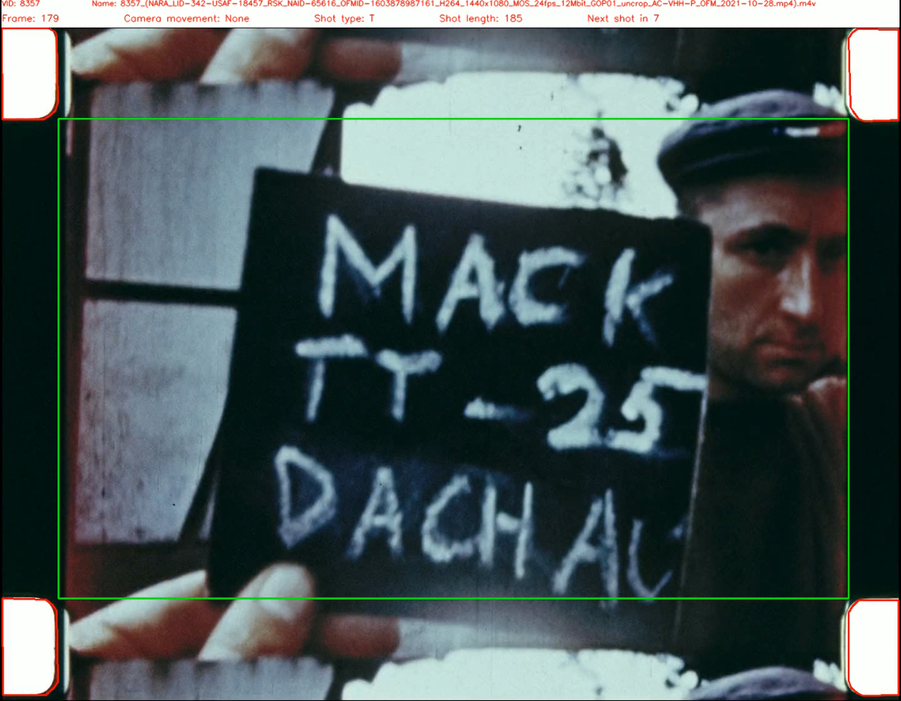
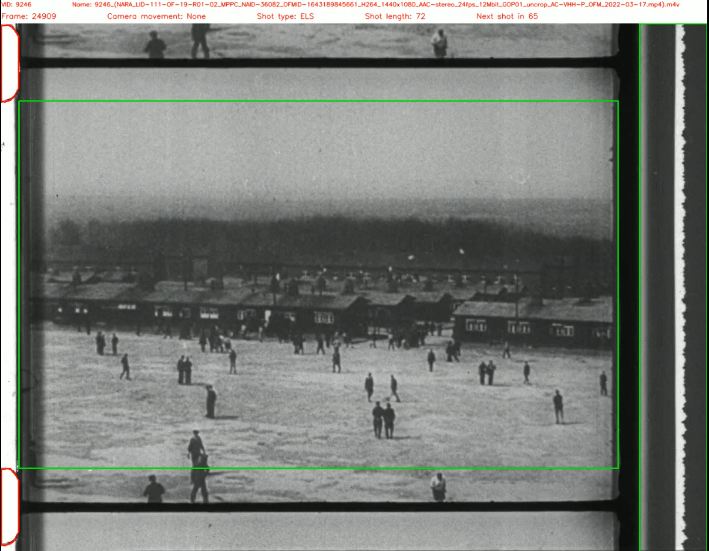
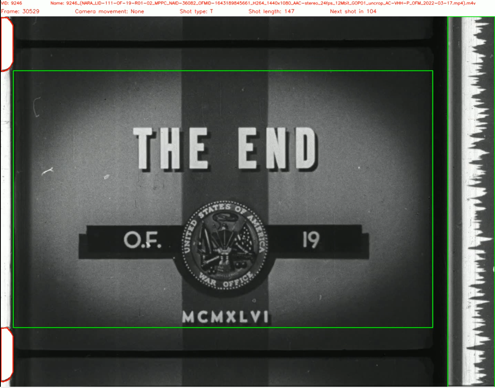
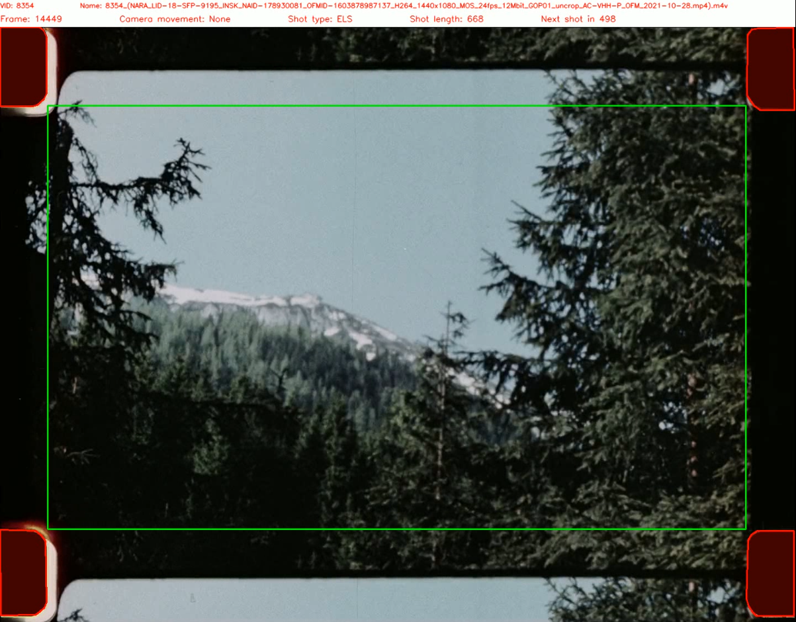
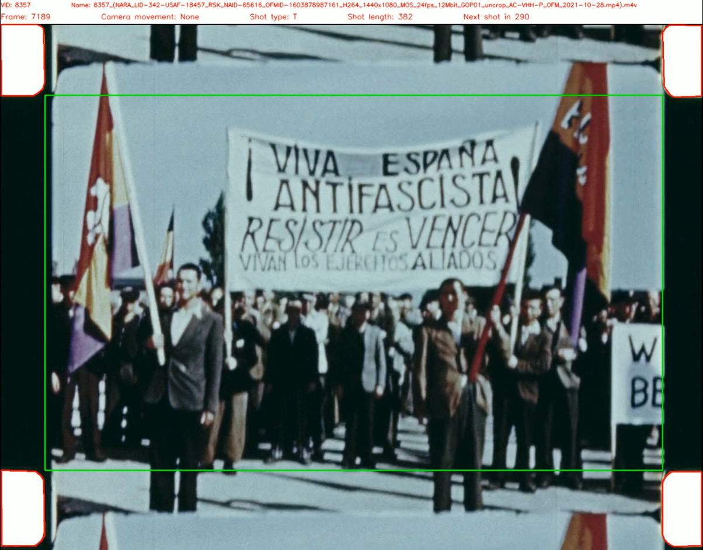
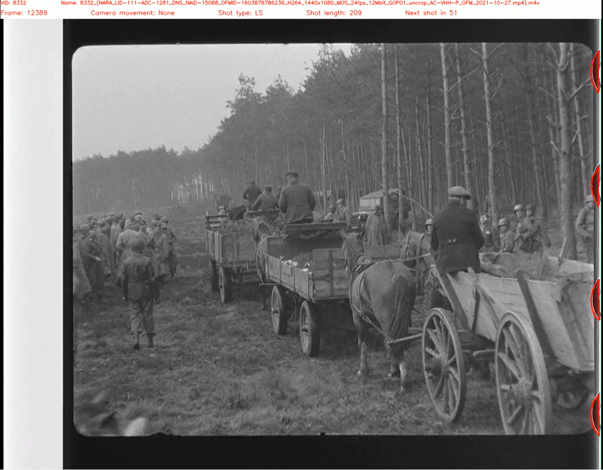

*Disclaimer: all images on this page were preselected to not contain disturbing materials. However, the dataset contains unfiltered material that many might find disturbing.*

# HISTORIAN dataset code repository
The official code repository for the historian dataset of the "HISTORIAN: A Large-Scale HISTORIcal Film Dataset with Cinematographic ANnotation" paper. The dataset can be found [here](https://drive.google.com/drive/folders/1d5Q8cRdGzZemCxCGUwA0VfN5cncpzYhR?usp=sharing), it contains 98 historical films with annotated shot boundaries, shot types, camera movements, sprocket holes, overscan and film types. The entire dataset is roughly 100gb large.

This repository contains all scripts to generate, evaluate and visualize the dataset from our data (meaning annotations and films). You do not need this repository to use our data. Explanations of how the data is structured are under `Dataset Structure` below.

  

## How to install
Installing this code is not necessary to use our dataset. 

- Clone the repository ```git clone github.com/dahe-cvl/historian_dataset```
- Change into this directory ```cd historian_dataset```
- Create a folder for the virtual environment ```mkdir venv```
- Create a virtual environment ```python3 -m venv venv```
- Activate virtual environment ```source venv/bin/activate```
- Install requirements ```pip install -r requirements.txt```
- Download data from the link above. Copy the content of the dataset into the repository directory. Afterwards, this directory should contain an `Films` and `Annotations` folder.
- If you intend to run some of our scripts please use ```python scripts/create_dirs.py``` to generate all directories that might be necessary.

## Dataset Structure
The following depicts a frame of a filme together with a visualization of annotations.


The data is split into the directories `Films` and `Annotations`.

`Films` contains 98 different films as `.m4v` files. The first four letters of a filename represent the video ID (VID). For example the VID of the film 
```
8367_NARA_LID-111-OF-11-R02_FGMC_NAID-36077_OFMID-1603882747755_H264_1440x1080_AAC-stereo_24fps_12Mbit_GOP01_crop_AC-VHH-P_OFM_2021-10-28.mp4).m4v
```
is 8367. This VID can be used to identify the correspond annotations.

`Annotations` contains manual and automatic annotations of the 98 films. The annotations are organized into directories. Each directory contains annotations of a specific type that can be mapped to a film via a VID. Note that not every type of annotation is available for each film as, for example, not every film has camera movements or overscan area.


`shot-annotations_automatic` and `shot-annotations_manual` contain shot annotations obtained via automatic or manual annotation, respectively. Each file splits a film into a series of shots and assigns a shot type to each film. For example the following
```
{
        "shotId": 5,
        "inPoint": 810,
        "outPoint": 1001,
        "shotType": "MS"
},
```
is the fifth shot in a film, it starts at frame 810 and its last frame is 1001. This shot is of type `medium shot` (MS).

`camera_annotations_manual` contain manual camera annotations for the films. For example the following
```
{
        "shotId": 39,
        "cmId": 6,
        "Start": 13589,
        "Stop": 13778,
        "class_name": "tilt"
},
```
is the 6th detected camera movement in the film and occurs in shot 39 starting at frame 13589 and ending with frame 13778. This type of camera movement is a `tilt`.

`overscan_manual` contains overscan annotations for each film. Each file has annotations for multiple frames in the film. Each of those frames is annotated with polygons that mark sprocket holes and depending on the film type the frame window. The figure below shows an example of this: red areas are sprocket holes and the green area is the frame window.


Finally, `metadata.csv` contains a list of all films and the film type for example `35mm with black sprocket holes` or `16mm with white sprocket holes`.

## How to Use the Scripts
While this repository contains many scripts, we think the following two are the most relevant.

```visualize_annotation.py``` can be used to visualize annotations via
```
python scripts/visualize_annotation.py $VID $Frames
```
Where $VID is the video idea (for example 427).
The optional $Frames paramter is the distance between rendered frames.
For example for 10 this means that every tenth frame gets rendered.
This makes the resulting video files significantly smaller.
The default value is 1, meaning that every frame gets rendered. All images on this page were generated via this script.


```sprocketHolesFinder.py``` can be used to generate additional sprocket holes annotations from a single annotation. Our manual sprocket hole annotations only cover selected frames spread over the entire film. If the sprocket hole position moves, this might not be covered via our annotations. This script allows you to automatically detect sprocket holes given you already have at least one annotation.
Use it via
```
python sprocketHolesFinder.py $path_film $path_osd $path_sbd $path_output
```
Where $path_film points to the a film (in `Films`), $path_osd points to the overscan annotation, $path_sbd (in `overscan_manual`) points to the shot annotations (found in `shot-annotations_automatic` / `shot-annotations_manual`)  $path_output is the path to a file that should store the output.

Finally, the file ```Generate_data_commands.md``` contains information how scripts were used to generate the data. 


## How to Cite
If you use our data, code or ideas, please cite
```
@inproceedings{HISTORIAN,
  title={HISTORIAN: A Large-Scale HISTORIcal Film Dataset with Cinematographic ANnotation},
  author={Helm, Daniel and 
          Jogl, Fabian and 
          Kampel, Martin},
  booktitle={TBD},
  year={2022}
}
```

## Background
This work is part of the [`Visual History of the Holocaust`](https://www.vhh-project.eu/) project. The raw data is from [VHH-MMSI](https://www.vhh-mmsi.eu). Automatic annotations were obtained with our own tools:
- [vhh_sbd](https://github.com/dahe-cvl/vhh_sbd) computes shot boundaries, that is, it splits a given film into different shots.
- [vhh_stc](https://github.com/dahe-cvl/vhh_stc) classifies shots into different types, for example "text" for shots that display mainly text (e.g. in titles) and "close up" for shots featuring the subject of interest close to the camera.
- [vhh_cmc](https://github.com/dahe-cvl/vhh_cmc) can detect camera movements in a film.
- [vhh_core](https://github.com/dahe-cvl/vhh_core) combines all of these programs for ease of use.

## Acknowledgements
Visual History of the Holocaust: Rethinking Curation in the Digital Age. This project has received funding from the European Union’s Horizon 2020 research and innovation program under the Grant Agreement.

